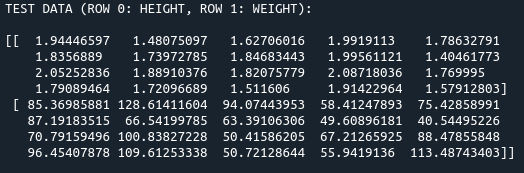
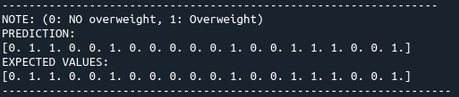
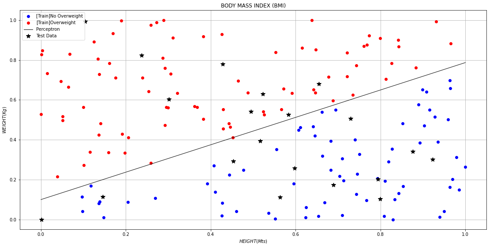
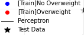

# Perceptron

The perceptron algorithm was invented in 1958 at the Cornell Aeronautical Laboratory by Frank Rosenblatt. This algorithm is used to train the neuronal model created by McCulloch-Pitts.

### Model

  

It is an algorithm used for supervised learning of binary classifiers. Binary classifiers decide whether an input, usually represented by a series of vectors, belongs to a specific class. In short, a perceptron is a single-layer neural network. They consist of four main parts including input values (X), weights (W) and bias (B), net sum (Weight sum), and an activation function (Decides to which class belongs each input). 

The perceptron only solves problems with linear separability, this means that the classes of the problem can be splitted with a line, plane or hyperplane.

## Body Mass Index (BMI)

It's an example that uses the perceptron to predic things. In this case the perceptron is suposed to predict if a dataset of some people information  (weights and heights) are overweight or not.

### To do this we have to do the following steps:
1. Create a trainning dataset
2. Train the perceptron with that dataset(normalized)
3. Create test dataset(the data we want to predict)
4. Make predictions with the test dataset(also normalized)

After training the perceptron with random weights and heights, now we want to predict new data. This data looks like follows:

### Test dataset (what we want to predict)

  

### Make the prediction 

  

'1' means overweight, '0' otherwise. As we can see, the perceptron prediction was very good. Not always the prediction is 100% precise, but most of the time.

 ### Results

  

The black line is the perceptron, which splitted the data in two classes: with overweight and with no overweight. The red and blue points are the ones we train the algorithm, the star simbol ones are the predicted data (test data).  

 ### leyend 

  

## Libraries 

* numpy
* matplotlib