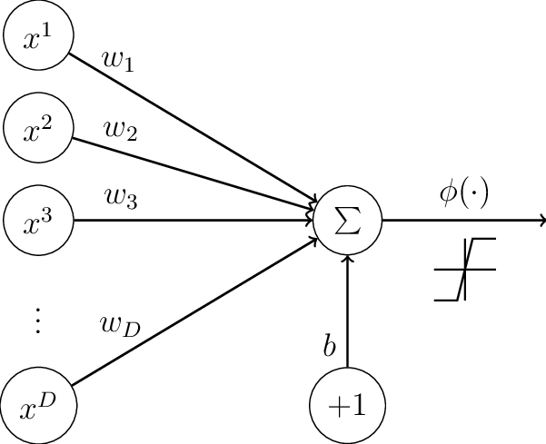

# Perceptron

The perceptron algorithm was invented in 1958 at the Cornell Aeronautical Laboratory by Frank Rosenblatt. This algorithm is used to train the neuronal model created by McCulloch-Pitts.

## McCulloch-Pitts Artificial Neuron:
